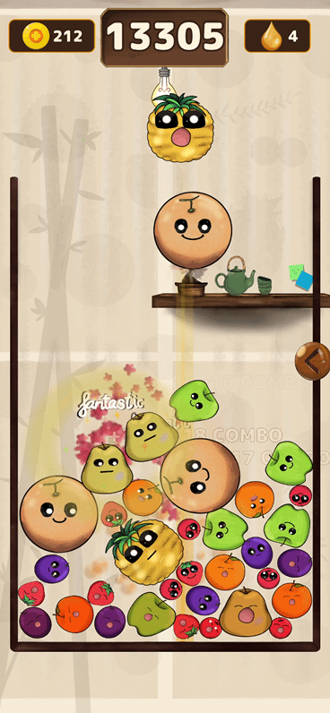
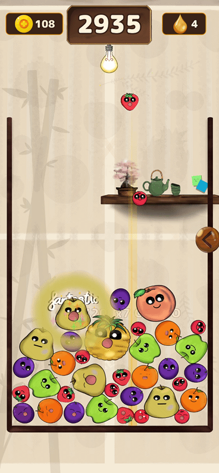
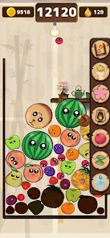
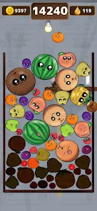
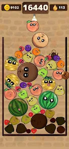

# Rot & Merge

A physics-based fruit-merge mobile game, built solo in Godot 4.6 and live on Google Play.
I designed and coded the game, drew every sprite, and made all the music and sound effects.

**[▶ Get it on Google Play](https://play.google.com/store/apps/details?id=com.pelit.rotandmerge)**

## Gameplay

 

## Screenshots

  

## What I built

- Physics-based fruit merge gameplay in GDScript (Godot 4.6)
- Powerups, scene transitions, and menu animations
- All sprites and animations hand-drawn in Ibis Paint
- Original music and sound effects made in BandLab and Audacity
- AdMob ads with GDPR consent handling
- Full Play Store release: closed testing, Play Console setup, production launch

## Art process

I drew every sprite myself. Speedpaintings of the designs:
[YouTube playlist](https://youtube.com/playlist?list=PLPSOz0Z5pnUE&si=3NVulzPgDBemVd1p)

## Tech

Godot 4.6 · GDScript · Ibis Paint · BandLab · Audacity

## License

Copyright (c) 2026 Rithul. All rights reserved.
